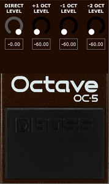
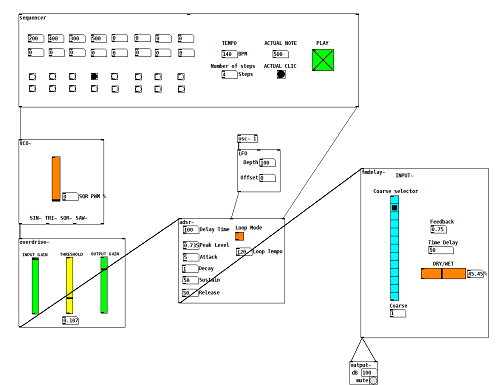
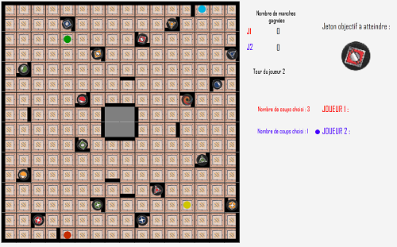
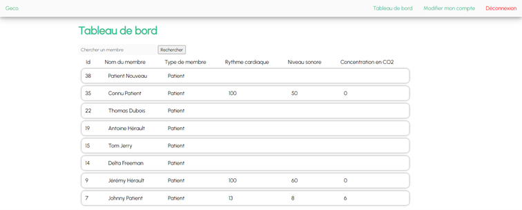
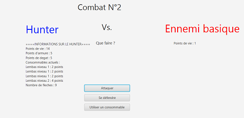
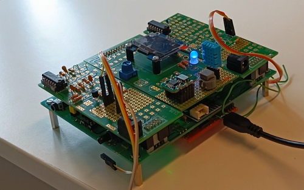
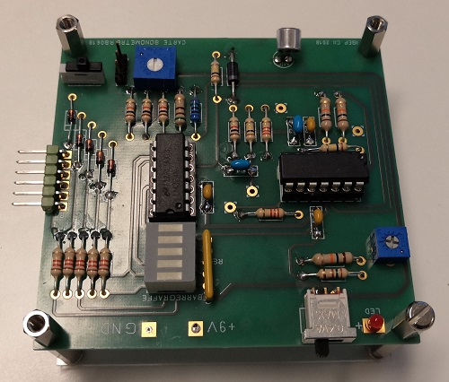

## Projets Professionnels  
### En cours
#####  2023-2024  - [CCRMA](https://ccrma.stanford.edu) -  FAST  - Fast Audio Signal-processing Technologies on FPGA (FAUST, Linux, Système embarqué) 

  Développement et implémentation d'un algorithme en FAUST (dans un FPGA) pour la spatialisation de plusieurs sources audio sur un système d'enceintes (multicanal).
  
  Intégration de la FPGA dans un réseau d'échanges de sources audio et de diffusion sur un système d'enceintes.

  Plus d'informations [ici](https://fast.grame.fr)

 

### Terminé
#####  2022  - [Akoustic Arts](https://www.akoustic-arts.com) - Compresseurs multi-bandes (Sigma Studio, ADAU1451)

  Conception et mise en œuvre d’algorithmes de traitement du son (compresseurs, générateurs harmoniques, limiteurs, filtres, modulation DSB) sur Sigma Studio.
  
  Mise en œuvre d’une chaîne de traitement audio dans un DSP ADAU1451.

 
 

## Projets Personnels  
### En cours
#####  2023  - Octaver (C++/JUCE) - [Lien vers le repository](https://github.com/jawsberrebi/octaver)

  Reproduction d'une pédale d'effet de type "octaveur" Boss OC-5 sous forme de plugin pour une utilisation au sein d'un DAW.

#####  2023  - Live Modular Library (Pure Data) -  [Lien vers le repository](https://github.com/jawsberrebi/LiveModular-Library)

  

  Création d'une bibliothèque d'objets graphiques (oscillateur, séquenceur, LFO...) pour une utilisation en performance live (à l'instar d'un synthétiseur modulaire virtuel).

 

### Terminés
#####  2023  - Filtre IIR (MATLAB) - [Lien vers le repository](https://github.com/jawsberrebi/Noise_Cancelling_IIR_Filter)

  Conception d'un filtre IIR pour supprimer des fréquences parasites (détection automatique) dans un signal audio.

#####  2023  - Filtre de suppression d'écho (MATLAB) - [Lien vers le repository](https://github.com/jawsberrebi/Echo_Cancellation_Filter)

  Conception d'un filtre pour supprimer un écho dans un signal audio.

#####  2023  - Algorithme de restauration d'image (MATLAB) - [Lien vers le repository](https://github.com/jawsberrebi/Image_Restoration)

  Conception d'un algorithme de restauration d'images comportant des lignes décallées de quelques pixels.

#####  2023  - Cypher Project (C, Verilog, Système embarqué)

  Développement et implémentation d'un algorithme de cryptage de chaînes de caractères (en C embarqué) dans un FPGA.

#####  2022  - Ricochet Robot (Java/JavaFX) - [Lien vers le repository](https://github.com/jawsberrebi/ricochet_robot)

  

  Développement du jeu de plateau "Ricochet Robots" jouable sur interface graphique.

#####  2022  - Geco (PHP, Javascript, SQL, HTML/CSS) - [Lien vers le repository](https://github.com/jawsberrebi/geco)

  

  Développement d'un site internet en PHP, Javascript et HTML/CSS, avec un système de gestion de comptes (stockés dans une base de données en SQL), d'affichage d'informations (page d'accueil, liste des comptes 
  et leurs informations personnelles) pour le suivi de patients en hôpital.

#####  2022  - Mini RPG 3000 (Java/JavaFX) - [Lien vers le repository](https://github.com/jawsberrebi/Mini_RPG_Lite_3000)

  

  Développement d'un jeu de type RPG (sous forme d'un système de fenêtres et de boîtes de dialogue).

#####  2022  - Station électronique de récupération de mesures (électronique analogique, Energia, Arduino)
  

  Conception d'une station de récupération de mesures (rythme cardiaque, concentration en CO2, température/humidité, niveau sonore) avec un microcontrôleur.

  Formatage des données des mesures récupérées pour un envoi par Bluetooth.

#####  2020  - Développement d'un sonomètre analogique (électronique analogique) avec affichage du niveau sonore sur un bargraphe 
  