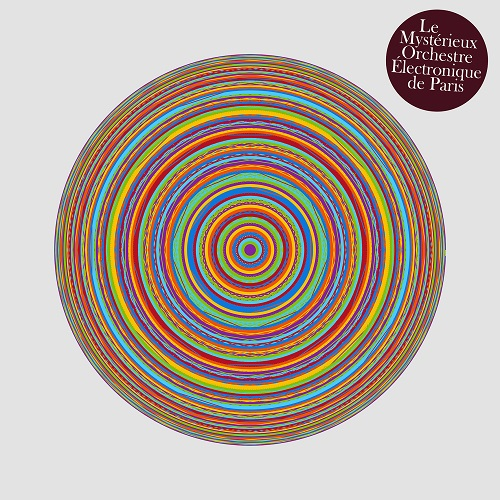

## Le Mystérieux Orchestre Électronique de Paris
### Musique électronique/ambient
{:.rounded}{:.shadow}

Premier album paru sur [Versatile Records](https://versatilerecords.bandcamp.com) le 5 février 2024. En écoute sur BandCamp [ici](https://versatilerecords.bandcamp.com/album/le-myst-rieux-orchestre-lectronique-de-paris).

> "In 2020, Le Mystérieux Orchestre Électronique de Paris started recording some pieces of Furniture Music, for activities requiring concentration, or simply for relaxation.
The Orchestra uses generative music processes. Electronic tools are considered interpreters, who are bona fide part of the ensemble. Analog synths are used along composition software. One of the main dogmas is the exclusion of any percussive instrument. These purely electronic sounds are contrasted with field recordings gleaned in various places.
Somewhere between Ambient, New Age, perhaps Krautrock, the first album by Le Mystérieux Orchestre Électronique de Paris is made up of musical pieces which are often about ten minutes long, in order for the listener to curl up into its pads and repetitive melodies."

    Composé, interprété, enregistré et mixé par Richard Berrebi à Colloquium 24 
    Masterisé par Nicolas Chaix à Victor studio.Paris 
    Pochette par Richard Berrebi et Nicolas Chaix  

